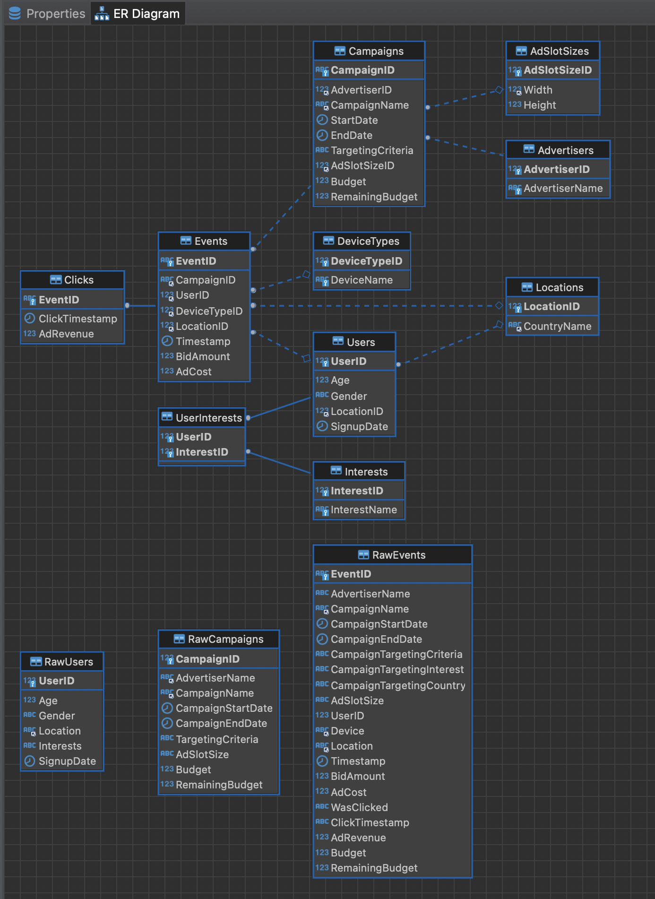
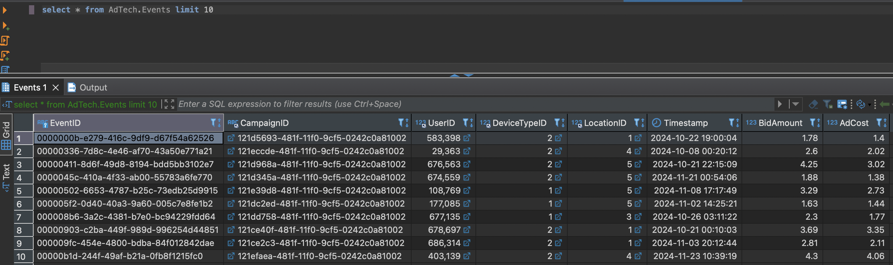

# AdTech ETL Pipeline

## Про проєкт
Цей проєкт є автоматизованим ETL (Extract, Transform, Load) процесом, розробленим для обробки рекламних даних (AdTech). Він автоматично завантажує набори даних з Google Drive, розгортає ізольоване середовище з базою даних MySQL за допомогою Docker та завантажує ці дані у відповідні "сирі" (raw) таблиці для подальшого аналізу та трансформації.

## 🚀 Основні можливості
1. Автоматичне завантаження даних: Скрипт самостійно завантажує CSV-файли з наданих посилань Google Drive.
2. Ізольоване середовище: Docker та Docker Compose створюють повністю ізольоване та відтворюване середовище, що усуває проблеми з локальними залежностями.
2. Оркестрація сервісів: docker-compose керує запуском, зупинкою та взаємодією між базою даних та ETL-скриптом.
3. Автоматична підготовка БД: Скрипт очікує повної готовності бази даних, після чого створює необхідні таблиці та завантажує в них дані.
4. Збереження даних: Дані бази зберігаються у Docker-томі (volume), що гарантує їх збереження між перезапусками контейнерів.

> Підходить для локальної аналітики, CI‑pipeline або швидких PoC‑демо в адтех‑домені.

---

## 🛠️ Використані технології

| Шар        | Технології                                                                                                                |
|------------|---------------------------------------------------------------------------------------------------------------------------|
| Контейнери | **Docker 24+**, **Docker Compose v2**                                                                                     |
| База даних | **MySQL 8.4 (oraclelinux9, local\_infile = 1)**                                                                           |
| Інтеграція | Bash 5, **gdown 5** (Python 3.11), curl 8                                                                                 |
| ETL логіка | SQL‑скрипти `load_raw_data.sql`, `create_table.sql`, `load_clean_data.sql`                                                |
| Тюнінг     | `bulk_load.cnf` із параметрами `innodb_buffer_pool_size`, `bulk_insert_buffer_size`, `innodb_flush_log_at_trx_commit = 2` |

---

## ⚙️ Як запустити

1. **Вимоги**: Docker ≥ 24, docker‑compose v2, 4GB RAM, стабільний інтернет.
2. **Клон**:
   ```bash
   git clone https://github.com/mlozhevych/setuniversity-de.git
   cd HW-1
   ```
3. **Білд + запуск**:
   ```bash
   docker compose build   # ~3хв, тягне MySQL8.4 та gdown
   docker compose up -d   # піднімає й запускає ініт‑скрипти
   docker compose logs -f db  # слідкуйте за прогрес‑барами gdown
   ```
4. **Перевірка**:
   ```bash
   docker exec -it adtech-mysql mysql -u root -prootpass -e "SELECT COUNT(*) FROM AdTech.RawEvents;"
   ```
5. **Доступ до БД**: `localhost:3306`/ **adtech / adtechpass**.

### Скидання й повторний імпорт

```bash
docker compose down -v   # видаляє томи й схему
docker compose up -d     # ініціалізація спочатку
```

---

## 🗂️ Опис основних таблиць

| Таблиця           | Призначення                                                                                                                                             | Основні колонки                                                                                                                                                      |
|-------------------|---------------------------------------------------------------------------------------------------------------------------------------------------------|----------------------------------------------------------------------------------------------------------------------------------------------------------------------|
| **RawEvents**     | Найбільша таблиця, що містить лог усіх рекламних подій: покази, кліки, вартість реклами, інформацію про пристрій та локацію користувача під час показу. | `EventID` (PK), `CampaignName`, `UserID`, `Device`, `Location`, `Timestamp`, `WasClicked`, `ClickTimestamp`, `BidAmount`, `AdCost`, `DeviceTypeID`\*, `LocationID`\* |
| **RawUsers**      | Зберігає вихідну інформацію про користувачів: демографічні дані (вік, стать), локацію, інтереси та дату реєстрації.                                     | `UserID` (PK), `Age`, `Gender`, *…*                                                                                                                                  |
| **RawCampaigns**  | Містить вихідні дані про рекламні кампанії: їх метадані, бюджет, дати проведення та назви.                                                              | `CampaignID`, `AdvertiserName`, `CampaignName`, *…*                                                                                                                  |
| **Campaigns**     | Рекламні кампанії.                                                                                                                                      | `CampaignID` (PK), `CampaignName`, `StartDate`, `EndDate`, `Budget`                                                                                                  |
| **DeviceTypes**   | Довідник типів пристроїв.                                                                                                                               | `DeviceTypeID` (PK), `DeviceName`                                                                                                                                    |
| **Locations**     | Довідник геолокацій.                                                                                                                                    | `LocationID` (PK), `CountryName`, `Region`, `City`                                                                                                                   |
| **Events**        | Нормалізована таблиця показів.                                                                                                                          | `EventID` (PK), `CampaignID` (FK), `UserID`, `DeviceTypeID`, `LocationID`, `Timestamp`, `BidAmount`, `AdCost`                                                        |
| **Clicks**        | Нормалізована таблиця кліків.                                                                                                                           | `EventID` (PK, FK → Events), `ClickTimestamp`, `AdRevenue`                                                                                                           |
| **UserInterests** | НЦе сполучна таблиця (junction/linking table), яка реалізує зв'язок "багато-до-багатьох" між користувачами (Users) та їхніми інтересами (Interests).    | `UserID` (PK, FK → Users), `InterestID` (PK, FK → Interests)                                                                                                         |
| **Advertisers**   | Довідкова таблиця (lookup table), яка містить унікальний список усіх рекламодавців.                                                                     | `AdvertiserID` (PK), `AdvertiserName`                                                                                                                                |
| **AdSlotSizes**   | Довідкова таблиця, що зберігає унікальні розміри рекламних слотів (наприклад, 300x250, 728x90).                                                         | `AdSlotSizeID` (PK), `Width`, `Height`                                                                                                                               |
| **Users**         | Це основна таблиця-вимір (dimension table), що зберігає унікальну інформацію про кожного зареєстрованого користувача.                                   | `UserID` (PK), `Age`, `Gender`, `LocationID` (FK → Locations), `SignupDate`                                                                                                      |




## 📈 Оптимізація продуктивності

- `LOAD DATA INFILE` працює в `/var/lib/mysql-files` (значення `secure_file_priv`).
- `ALTER TABLE … DISABLE KEYS` — один rebuild замість мільйонів вставок у PK.
- Параметри `bulk_load.cnf` увімкнені весь час; якщо це продакшен — видаліть файл після первинного імпорту й перезапустіть контейнер.

---

## 📜 Ліцензія

Цей проєкт ліцензовано під MIT License. Детальніше дивись у файлі `LICENSE`.