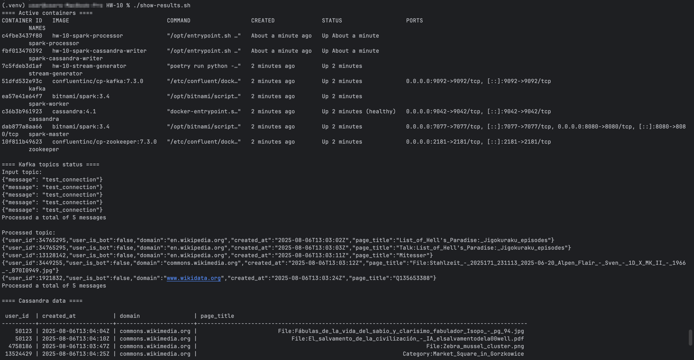

# HW-10: Wikipedia Stream Processing with Spark, Kafka and Cassandra

Цей проект демонструє повний конвеєр потокової обробки даних у реальному часі з використанням Apache Spark Streaming,
Apache Kafka та Apache Cassandra. Система обробляє події створення сторінок з Wikipedia API, фільтрує їх за заданими
критеріями та зберігає в базу даних Cassandra.

---

## Архітектура системи

Проект складається з наступних компонентів:

1. **Stream Generator**: Отримує дані з Wikipedia API і надсилає їх у Kafka-топік "input".
2. **Spark Streaming Processor**: Читає дані з Kafka-топіка `input`, фільтрує їх і відправляє у Kafka-топік "processed".
3. **Spark Streaming Cassandra Writer**: Читає оброблені дані з Kafka-топіка `processed` і зберігає їх у Cassandra.

___

## Вимоги

- **Docker** та **Docker Compose**
- **Python** 3.9+
- **Poetry**

___

## Структура проекту

```
HW-10/
├── docker-compose.yml         # Опис всіх сервісів системи
├── start-services.sh          # Скрипт для запуску системи
├── show-results.sh            # Скрипт для перегляду результатів
├── stop-services.sh           # Скрипт для зупинки системи
├── stream-generator/          # Генератор потоку даних з Wikipedia API
├── spark-streaming-processor/ # Обробник потоку даних Spark
└── spark-streaming-cassandra-writer/ # Запис даних у Cassandra
```

---

## Опис фільтрації даних

Система фільтрує події створення сторінок за наступними критеріями:

- Домен події має бути одним з: "en.wikipedia.org", "www.wikidata.org", "commons.wikimedia.org"
- Користувач, який створив сторінку, не повинен бути ботом (поле user_is_bot = false)

---

## Структура таблиці в Cassandra

```sql
CREATE TABLE wikipedia.page_creations
(
    user_id    TEXT,
    domain     TEXT,
    created_at TEXT,
    page_title TEXT,
    PRIMARY KEY (user_id, created_at)
)
```

---

## Запуск системи

1. Зробіть скрипти виконуваними:
   ```bash
   chmod +x start-services.sh show-results.sh stop-services.sh
   ```

2. Запустіть систему:
   ```bash
   ./start-services.sh
   ```

3. Перевірте результати (через кілька хвилин, коли накопичяться дані):
   ```bash
   ./show-results.sh
   ```



4. Зупиніть систему:
   ```bash
   ./stop-services.sh
   ```

--- 

## Компоненти системи

### Stream Generator

Генератор потоку даних використовує бібліотеку sseclient-py для підключення до SSE (Server-Sent Events) потоку Wikipedia
API. Він отримує події створення сторінок у реальному часі та надсилає їх у Kafka-топік "input".

### Spark Streaming Processor

Цей компонент використовує Apache Spark Streaming для обробки даних з Kafka. Він читає дані з топіка `input`, фільтрує
їх за зазначеними вище критеріями та надсилає оброблені дані в топік `processed`.

### Spark Streaming Cassandra Writer

Цей компонент читає оброблені дані з Kafka-топіка `processed` та зберігає їх у таблицю Cassandra. Він використовує Spark
Cassandra Connector для ефективного запису даних у Cassandra.
