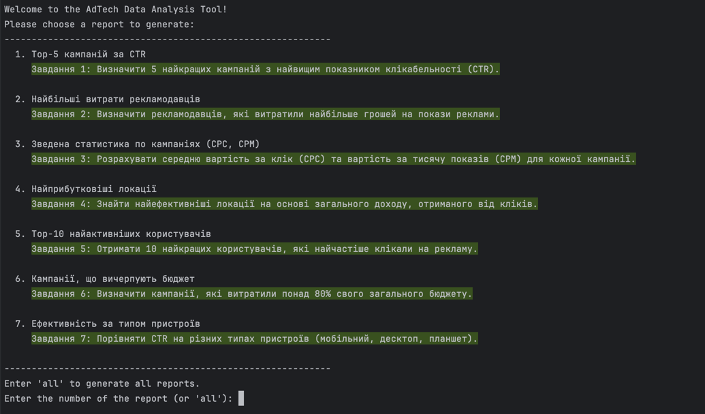
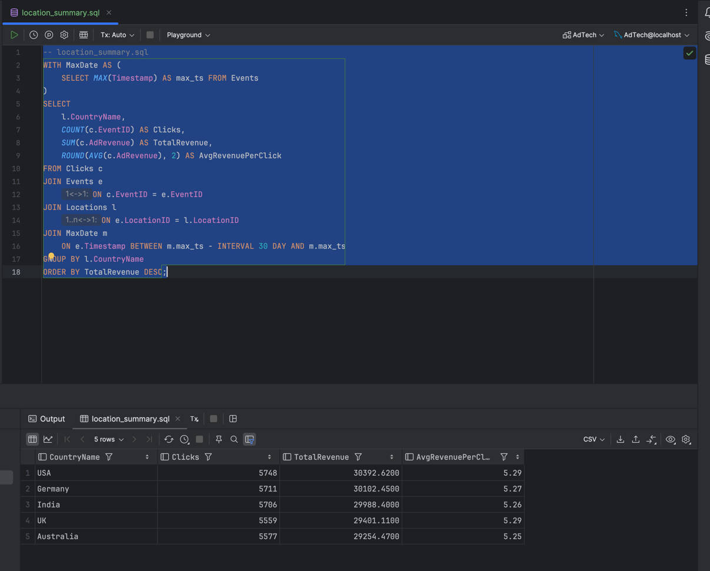
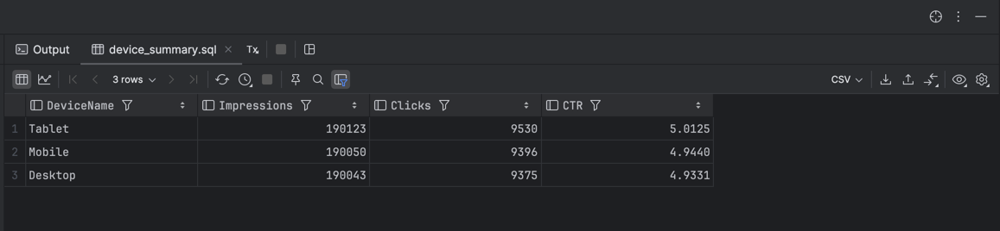

# Інструмент для аналізу рекламних даних (AdTech)

Цей проєкт є комплексним інструментом для аналізу даних у сфері рекламних технологій. Він дозволяє розгортати базу даних
за допомогою Docker, завантажувати в неї дані та запускати аналітичні скрипти для генерації звітів про ефективність
рекламних кампаній.

## 🚀 Основні можливості

* **Автоматизоване розгортання:** Проєкт використовує Docker та Docker Compose для легкого налаштування та запуску
  середовища бази даних MySQL.
* **Ініціалізація бази даних:** Спеціальний скрипт автоматично завантажує резервну копію бази даних з Google Drive та
  відновлює її.
* **Аналітичний інструмент:** Інтерактивний CLI (інтерфейс командного рядка) на Python для генерації різноманітних
  звітів.
* **Генерація звітів:** Створення детальних звітів у форматах CSV та JSON для подальшого аналізу.
* **Гнучке керування:** Можливість генерувати як окремі звіти, так і всі одразу.
* **Резервне копіювання:** Скрипт для створення резервних копій бази даних, за винятком "сирих" таблиць.

## 🛠️ Технологічний стек

* **Контейнеризація:** Docker, Docker Compose
* **База даних:** MySQL
* **Мова програмування:** Python 3.10+
* **Бібліотеки Python:**
    * `pandas` - для обробки та аналізу даних
    * `mysql-connector-python` - для підключення до MySQL
    * `python-dotenv` - для керування змінними середовища
    * `scipy` - для статистичних розрахунків (наприклад, кореляції)
    * `poetry` - для керування залежностями та проєктом

## 📊 Доступні звіти

Аналітичний інструмент дозволяє генерувати наступні звіти:

1. **Top-5 кампаній за CTR:** Визначає 5 найкращих кампаній з найвищим показником клікабельності (CTR).
2. **Найбільші витрати рекламодавців:** Показує, які рекламодавці витратили найбільше грошей на рекламні кампанії.
3. **Зведена статистика по кампаніях (CPC, CPM):** Розраховує середню вартість за клік (CPC) та вартість за тисячу
   показів (CPM) для кожної кампанії.
4. **Найприбутковіші локації:** Знаходить найефективніші локації на основі загального доходу від кліків.
5. **Top-10 найактивніших користувачів:** Виводить 10 користувачів, які найчастіше клікали на рекламу.
6. **Кампанії, що вичерпують бюджет:** Визначає кампанії, які витратили понад 80% свого бюджету.
7. **Ефективність за типом пристроїв:** Порівнює CTR на різних типах пристроїв (мобільний, десктоп, планшет).

## 📋 Початок роботи

### Передумови

* Встановлений **Docker** та **Docker Compose**.
* Встановлений **Python 3.10+** та менеджер пакетів **Poetry**.

### 1. Клонування репозиторію

   ```bash
   git clone https://github.com/mlozhevych/setuniversity-de.git
   cd HW-2
   ```

### 2. Налаштування змінних середовища

Для роботи аналітичного скрипту потрібно створити файл `.env` у каталозі `analyze-ads/`.

**Створіть файл**

  ```bash
  touch analyze-ads/.env
  ```

Додайте в нього наступні змінні, використовуючи дані з `docker-compose.yml`:

  ```
  DB_HOST=127.0.0.1
  DB_PORT=3306
  DB_USER=adtech
  DB_PASSWORD=adtechpass
  DB_NAME=AdTech
  ```

**Запуск бази даних**

Запустіть контейнер з базою даних MySQL за допомогою Docker Compose:

  ```bash
  docker-compose up -d --build
  ```

Ця команда створить та запустить контейнер з іменем `adtech-mysql1` у фоновому режимі.

Скрипт `init/init-db.sh` автоматично завантажить бекап та розгорне його.

    Примітка: 
    Для виконання скрипту переконайтеся, що у вас є доступ до Інтернету для завантаження файлу з Google Drive.

**Встановлення залежностей Python**

Перейдіть до каталогу `analyze-ads` та встановіть залежності за допомогою Poetry:

```bash
cd analyze-ads
poetry install
```

## ▶️ Як використовувати

Після виконання всіх кроків налаштування ви можете запускати аналітичний інструмент.
1. Переконайтесь, що ви перебуваєте в каталозі `analyze-ads`.
2. Запустіть головний скрипт через Poetry:

```bash
poetry run analyze-ads
```

3. Ви побачите інтерактивне меню, де можна обрати потрібний звіт для генерації, ввівши його номер.



4. Ви також можете ввести `all`, щоб згенерувати всі звіти одразу.
Згенеровані звіти будуть збережені в каталозі `analyze-ads/reports/` у форматах `.csv` та `.json`.
5. Усі скрипти, котрі використовувались для виконання роботи знаходяться у каталогу `analyze-ads/src/analyze_ads/queries/`.

### Приклади запуску скриптів

- Найприбутковіші локації:


- Ефективність за типом пристрою:
