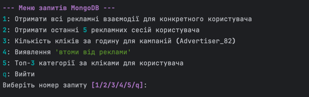

# Аналіз рекламних даних

Цей проєкт є консольним застосунком на Python для аналізу рекламних даних. Він використовує MongoDB для зберігання та
обробки інформації про сесії користувачів, кліки та взаємодії з рекламою. Проєкт використовує Docker для легкого
розгортання бази даних та автоматичного наповнення її початковими даними.

---

## 🚀 Основні можливості

- Автоматичне розгортання середовища з MongoDB за допомогою Docker Compose.
- Автоматичне наповнення бази даних початковими даними з Google Drive при першому запуску.
- Інтерактивне консольне меню для виконання готових аналітичних запитів:
    - [Аналіз "втоми від реклами" (Ad Fatigue)](./src/analyze_ads_nosql/mongo_queries/README.md#4-ad_fatiguepy)
    - [Розрахунок взаємодій з рекламою](./src/analyze_ads_nosql/mongo_queries/README.md#1-ad_interactionspy)
    - [Аналіз розподілу кліків по годинах доби](./src/analyze_ads_nosql/mongo_queries/README.md#3-clicks_per_hourpy)
    - [Отримання останніх сесій користувача](./src/analyze_ads_nosql/mongo_queries/README.md#2-last_sessionspy)
    - [Популярні категорії товарів](./src/analyze_ads_nosql/mongo_queries/README.md#5-top_categoriespy)

## 🛠️ Технологічний стек

- **Мова**: Python 3.11

- **База даних**: MongoDB

- **Контейнеризація**: Docker & Docker Compose

- **Менеджер залежностей**: Poetry

- **Ключові бібліотеки**:
    - `pymongo` - для взаємодії з MongoDB.
    - `pandas` - для обробки даних перед імпортом.
    - `gdown` - для завантаження файлів з Google Drive.
    - `python-dotenv` - для роботи з файлами конфігурації.
    - `rich` - для створення зручного інтерфейсу в консолі.

## ⚙️ Налаштування та запуск

Виконайте ці кроки, щоб розгорнути проєкт.

### **Крок 1: Передумови**

Переконайтесь, що на вашій машині встановлено:

- Docker
- Docker Compose
- Python 3.11
- Poetry

### **Крок 2: Конфігурація**

1. Склонуйте репозиторій:

  ```bash
   git clone https://github.com/mlozhevych/setuniversity-de.git
   cd HW-3/analyze-ads-nosql
  ```

2. Створіть файл `.env` у корені проєкту (`analyze-ads-nosql/`).

3. Скопіюйте в нього наведений нижче вміст та замініть значення `GDRIVE_..._ID` на ваші реальні ID файлів з Google
   Drive.

   **Файл `.env`:**
    ```
    # Налаштування для локального застосунку
    MONGO_HOST=localhost
    MONGO_PORT=27017

    # Облікові дані та назва БД
    MONGO_DB=AdTech
    MONGO_USER=adtechuser
    MONGO_PASSWORD=adtechpass

    # ID файлів для імпорту
    GDRIVE_USERS_FILE_ID=YOUR_GDRIVE_USERS_FILE_ID
    GDRIVE_EVENTS_FILE_ID=YOUR_GDRIVE_EVENTS_FILE_ID

    # Налаштування застосунку
    SESSION_TIMEOUT_MINUTES=30
    CSV_SEPARATOR=,
    ```

### **Крок 3: Запуск середовища та імпорт даних**

Ця команда автоматично розгорне базу даних MongoDB і наповнить її даними.

1. Відкрийте термінал у кореневій папці проєкту.
2. Виконайте команду:

  ```bash
  docker-compose up --build
  ```

Після виконання цієї команди у вашому терміналі запуститься контейнер з MongoDB, а потім автоматично запуститься і
завершиться контейнер `mongo-seed`, який заповнить базу даних (виконаються 2 скрипти: `import_sessions.py`,
`import_users.py`). Після цього база даних буде готова до роботи. Це може
зайняти достатньо часу. **_Переконайтеся у тому що у вас достатньо ресурсів._**

### **Крок 4: Запуск локального застосунку**

Коли база даних у Docker працює, ви можете запустити основний застосунок для аналізу.

1. Встановіть залежності проєкту за допомогою Poetry (якщо ви ще не зробили цього):
    ```bash
    poetry install
    ```
2. Запустіть головний скрипт:
    ```bash
    poetry run main
    ```
3. Після запуску ви побачите інтерактивне меню, де зможете обирати та виконувати аналітичні запити:



