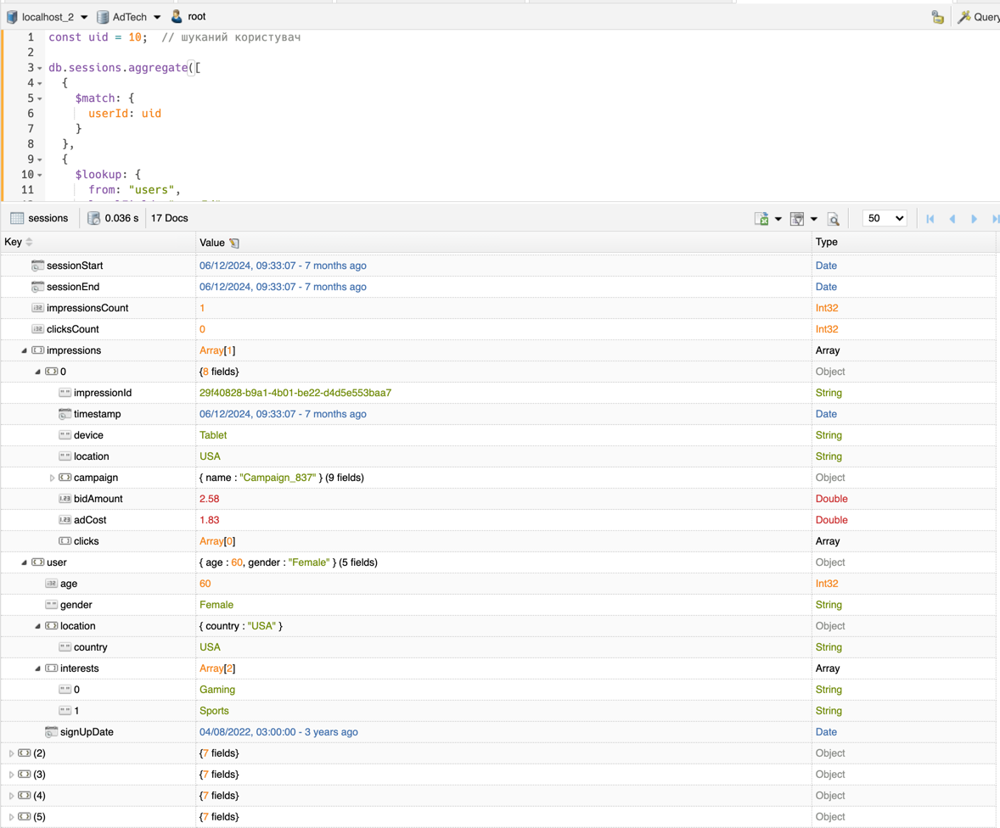
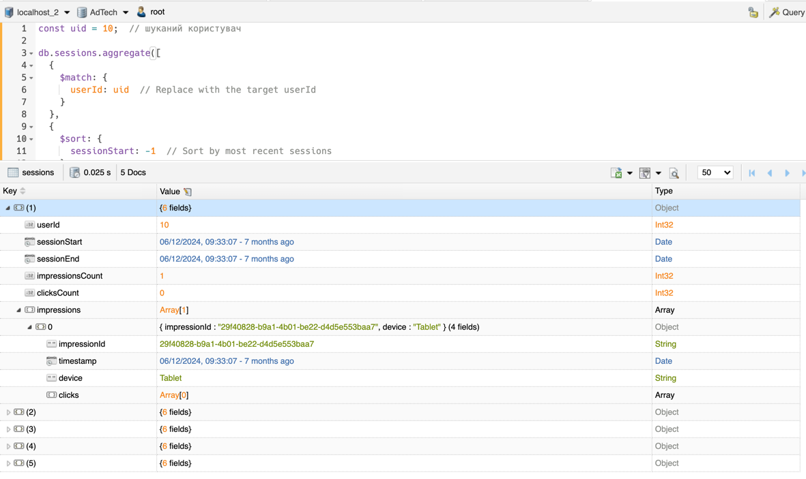
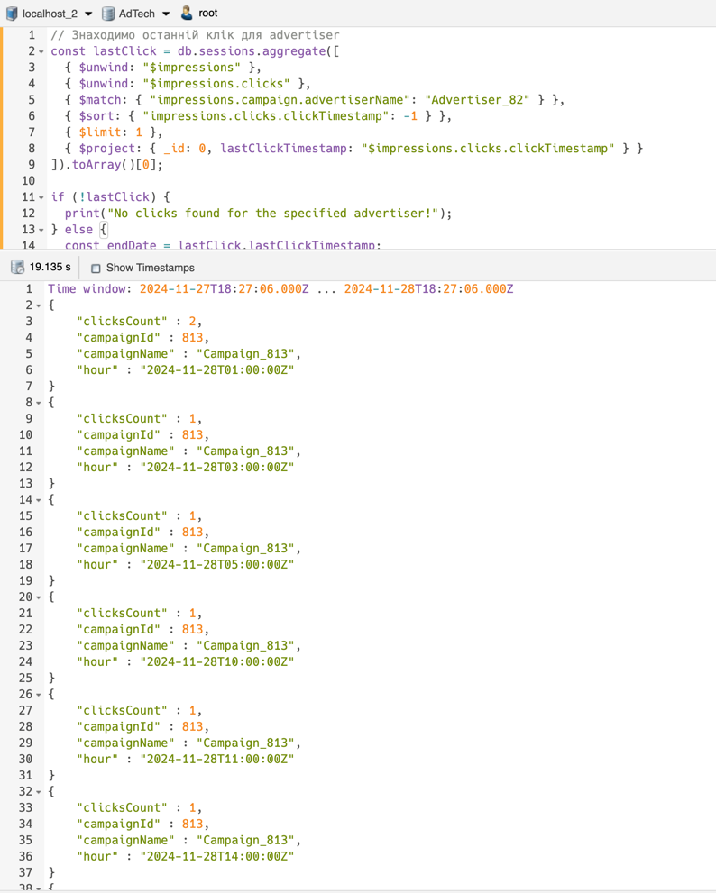
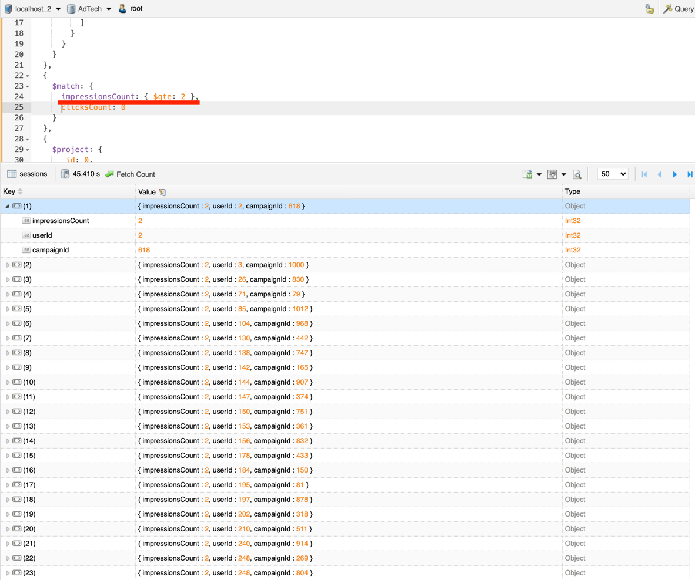
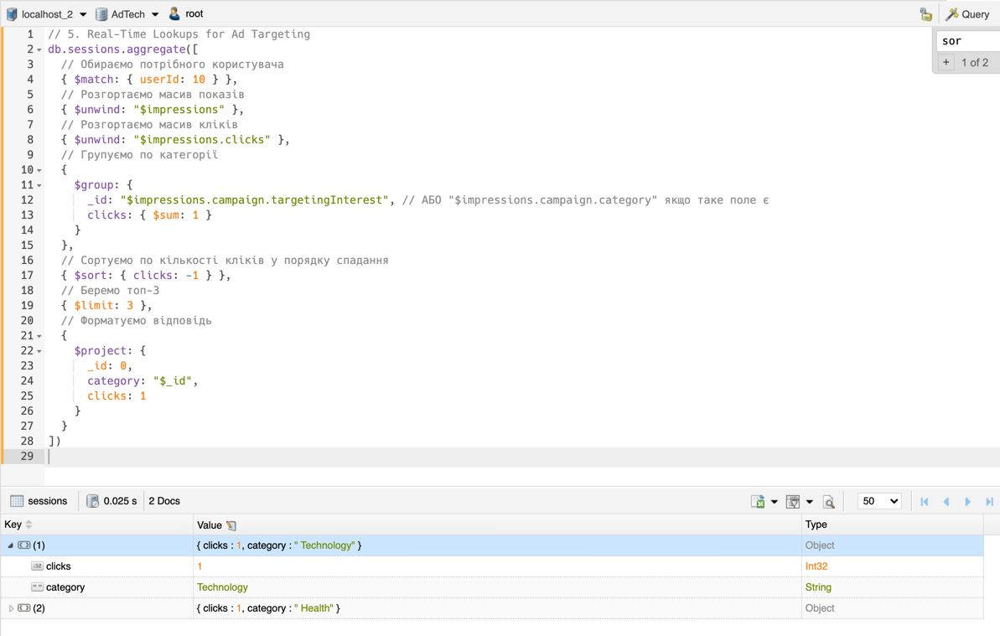

# MongoDB Pipelines Library

Колекція повторно використовуваних пайплайнів для аналітики рекламної активності з використанням MongoDB.

## Огляд скриптів

### 1. `ad_interactions.py`

**Призначення:**  
Отримати всі сесії користувача разом із його демографічною інформацією та деталями по показах та кліках.

**Вхідні дані:**

- `user_id` (int) — ідентифікатор користувача

**Результат виконання:**

### 2. `last_sessions.py`

**Призначення:**  
Отримати останні 5 сесій користувача з відмітками часу та поведінкою кліків.

**Вхідні дані:**

- `user_id` (int) — ідентифікатор користувача

**Результат виконання:**

### 3. `clicks_per_hour.py`

**Призначення:**  
Порахувати кількість кліків по годинах для кожної кампанії рекламодавця за 24-годинний.
_Було взято період від останнього кліку._

**Вхідні дані:**

- `advertiser_name` (str) — ім'я рекламодавця

**Результат виконання:**

### 4. `ad_fatigue.py`

**Призначення:**  
Виявити користувачів, яким рекламна кампанія показувалася 5+ рази (або більше) і при цьому клієнт не здійснив жодного
кліку.

**Результат виконання:**

- кількість переглядів було зменшено з 5 до 2 для того щоб показати здатність скрипту повертати дані
  

### 5. `top_categories.py`

**Призначення:**  
Повернути топ-N інтересів/категорій користувача за кількістю кліків.

**Вхідні дані:**

- `user_id` (int) — ідентифікатор користувача

**Результат виконання:**
