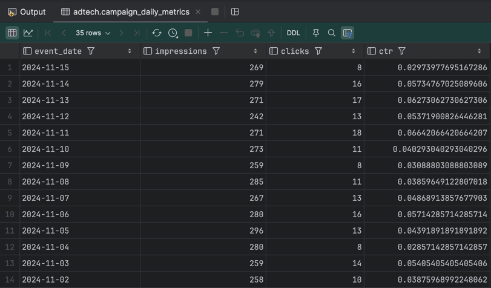
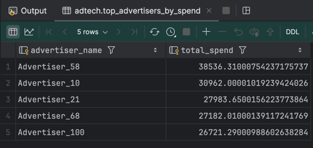
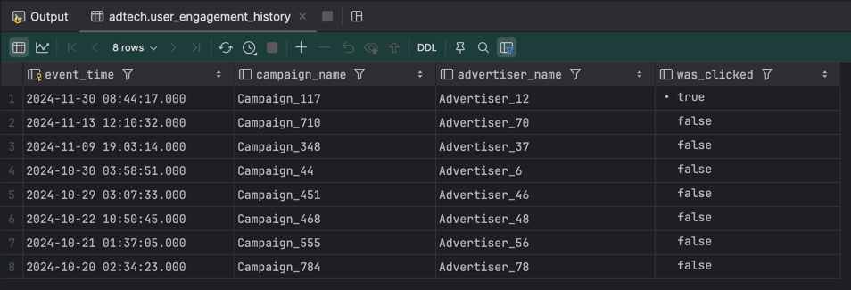
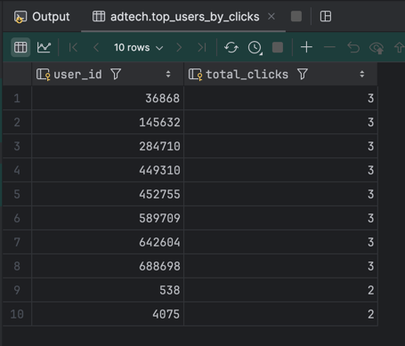
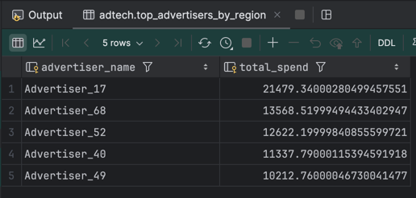

# Cassandra Queries

Ця директорія містить CQL (Cassandra Query Language) файли, що визначають структуру бази даних (`ddl_queries.cql`) та
приклади запитів для маніпуляції даними (`dml_queries.cql`).

## 📂 Файли

- `ddl_queries.cql`: Містить `CREATE` запити для всіх таблиць у кіспейсі `adtech`.

- `dml_queries.cql`: Надає приклади `INSERT`, `UPDATE`, `DELETE` та `SELECT` запитів.

## 🗂️ Опис таблиць (`ddl_queries.cql`) та приклади запитів (`dml_queries.cql`)

Нижче наведено опис аналітичних таблиць, створених для швидкого доступу до даних.

### 1. `campaign_daily_metrics`

Зберігає щоденну статистику ефективності для кожної рекламної кампанії.

Приклад запиту:

```cql
SELECT
    event_date,
    impressions,
    clicks,
    ctr
FROM
    adtech.campaign_daily_metrics
WHERE
    campaign_id = 101
ORDER BY
    event_date DESC;
```



### 2. `top_advertisers_by_spend`

Рейтинг рекламодавців за загальними витратами.

```cql
  SELECT
    advertiser_name,
    total_spend
FROM
    adtech.top_advertisers_by_spend
WHERE
    time_bucket = 'last_30_days_historical'
LIMIT 5;
```



### 3. `user_engagement_history`

Історія взаємодії користувачів з рекламою. Швидкий доступ до останніх подій

```cql
SELECT
    event_time,
    campaign_name,
    advertiser_name,
    was_clicked
FROM
    adtech.user_engagement_history
WHERE
    user_id = 302602
LIMIT 10;
```



### 4. `top_users_by_clicks`

Рейтинг користувачів за кількістю кліків за певний день. Оптимізована для TOP-N запитів.

```cql
SELECT
    user_id,
    total_clicks
FROM
    adtech.top_users_by_clicks
WHERE
    time_bucket = 'last_30_days_historical'
LIMIT 10;
```



### 5. `top_advertisers_by_region`

Рейтинг рекламодавців за витратами в межах певного регіону. Ефективна для географічної аналітики.

```cql
SELECT
    advertiser_name,
    total_spend
FROM
    adtech.top_advertisers_by_region
WHERE
    region = 'USA'
LIMIT 5;
```



Кожна таблиця використовує оптимальну структуру ключів партиціонування та кластеризації для забезпечення високої
продуктивності типових аналітичних запитів.