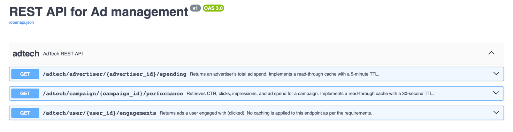
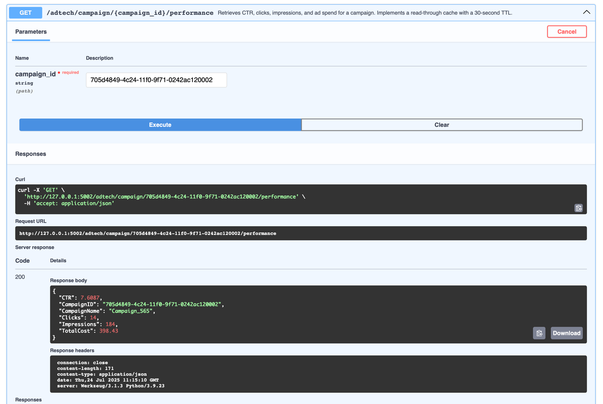

# REST API для аналізу рекламних кампаній

Цей проєкт є RESTful API, розробленим на Flask, для аналізу ефективності рекламних кампаній, витрат рекламодавців та
залучення користувачів. Він використовує кешування Redis для оптимізації продуктивності запитів.

---

## 🚀 Основні можливості

- **Аналіз ефективності кампанії:** Отримання детальних метрик для конкретної кампанії, включаючи CTR, кількість кліків,
  показів та загальні витрати.

- **Витрати рекламодавця:** Перегляд загальних витрат на рекламу для певного рекламодавця за останній місяць.

- **Залученість користувачів:** Отримання даних про взаємодію користувача з рекламою (кількість кліків та отриманий
  дохід).

- **Кешування з Redis:** Впроваджено read-through кеш для підвищення швидкості відповіді на запити щодо кампаній та
  рекламодавців.

- **Swagger UI:** Інтегрована документація API через Swagger для легкої взаємодії та тестування ендпоінтів.

---

## 🛠️ Технології

- **Backend:** Python, Flask, Flask-Smorest, Gunicorn

- **База даних:** MySQL (взаємодія через Flask-SQLAlchemy та PyMySQL)

- **Кешування:** Redis

- **Керування залежностями:** Poetry

- **Контейнеризація:** Docker, Docker Compose

- **Серіалізація/Валідація:** Marshmallow

---

## 📋 Вимоги

- Docker та Docker Compose

- Python 3.9+ (для запуску бенчмарк-скриптів)

- Poetry

---

## ⚙️ Встановлення та запуск

Проєкт налаштований для легкого запуску за допомогою Docker, що є рекомендованим способом.

### Запуск через Docker (Рекомендовано!)

1. **Клонуйте репозиторій:**
   ```bash
   git clone https://github.com/mlozhevych/setuniversity-de.git
   cd HW-5/analyze-ads-rest-api
   ```
2. **Налаштуйте змінні середовища:**

   Створіть файл `.env` у кореневій директорії `analyze-ads-rest-api` та додайте конфігурацію бази даних.
   `docker-compose.yml`
   вже налаштовано на використання `host.docker.internal` для підключення до вашої локальної бази даних з контейнера.

   ```env
   DATABASE_HOST=host.docker.internal
   DATABASE_USER=adtech
   DATABASE_PASSWORD=adtechpass
   DATABASE_DB=AdTech
   ```
3. **Запустіть за допомогою Docker Compose:**

   Ця команда запустить API сервіс та Redis.

   ```bash
   docker-compose up --build
   ```

   API буде доступний за адресою http://localhost:5002.


4. **Перейдіть до документації Swagger UI:**

   Відкрийте у браузері `http://localhost:5002/swagger-ui` для перегляду та взаємодії з ендпоінтами.

   

### Локальний запуск (для розробки!)

1. **Встановіть залежності проєкту за допомогою Poetry:**

   ```bash
    poetry install
    ```
2. **Активуйте віртуальне середовище, створене Poetry:**

   ```bash
    poetry shell
    ```

3. **Запустіть додаток:**

Переконайтеся, що змінні середовища для бази даних доступні у вашій сесії.

   ```bash
    poetry run python -m analyze_ads_rest_api.app
   ``` 

---

## 🌐 Endpoints API

Всі ендпоінти доступні за префіксом /adtech.

| Метод | URL                                    | Опис                                                                                         |
|-------|----------------------------------------|----------------------------------------------------------------------------------------------|
| GET   | `/campaign/{campaign_id}/performance`  | Отримує CTR, кліки, покази та витрати для кампанії. Результати кешуються на 30 секунд.       |
| GET   | `/advertiser/{advertiser_id}/spending` | Повертає загальні витрати рекламодавця за останні 30 днів. Результати кешуються на 5 хвилин. |
| GET   | `/user/{user_id}/engagements`          | Повертає дані про залученість користувача (кліки та дохід). Цей ендпоінт не кешується.       |

### Приклад запиту та відповіді

Запит та відповідь для отримання ефективності кампанії:


---

## 📊 Тестування продуктивності

Проєкт містить скрипт для тестування продуктивності ендпоінтів.

1. Переконайтеся, що API запущено (через Docker або локально).
2. Якщо ви не встановлювали залежності через `poetry install`, то зробіть це :) .
3. Запустіть бенчмарк-скрипт:

   ```bash
   poetry run runbenchmark
   ```

   Цей скрипт виконає 10 запитів до кожного ендпоінту та виведе наступну статистику:

| Endpoint                                                     | No Cache (ms) | Redis Cache (ms) | Δ‑Improvement |
|--------------------------------------------------------------|---------------|------------------|---------------|
| `/campaign/705d4849-4c24-11f0-9f71-0242ac120002/performance` | 1849.54       | 12.49            | 148.1x        |
| `/advertiser/3/spending`                                     | 5293.91       | 12.16            | 435.2x        |

---

## 📁 Структура проєкту

```
.
├── docker-compose.yml
├── Dockerfile
├── pyproject.toml              # Конфігурація проєкту та залежностей Poetry
├── poetry.lock
└── src
    └── analyze_ads_rest_api
        ├── __init__.py
        ├── app.py                  # Головний файл Flask додатку
        ├── benchmark.py            # Скрипт для тестування продуктивності
        ├── cache.py                # Функції для роботи з кешем Redis
        ├── db.py                   # Ініціалізація SQLAlchemy
        ├── models                  # Моделі даних SQLAlchemy
        ├── queries                 # SQL запити для аналітики
        ├── resources               # Ресурси (ендпоінти) Flask-Smorest
        └── schemas.py              # Схеми Marshmallow для валідації
```