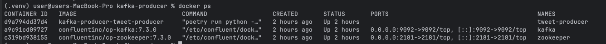
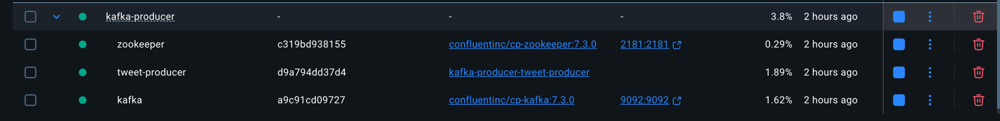
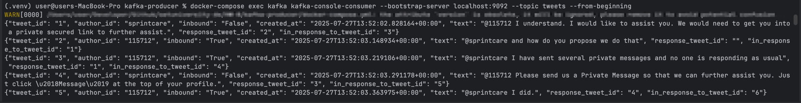

# Kafka Tweet Producer

Цей проєкт є продюсером Kafka, який симулює потік твітів. Він читає дані з CSV-файлу, що містить дані служби підтримки
Twitter, і надсилає їх як окремі повідомлення в топік Kafka "tweets".

--- 

## 🛠️ Технології

- **Мова**: Python 3.9+

- **Керування залежностями:** Poetry

- **Контейнеризація:** Docker, Docker Compose

## Швидкий старт

1. Склонуйте репозиторій:

  ```bash
    git clone https://github.com/mlozhevych/setuniversity-de.git
    cd HW-8/kafka-producer
  ```

2. Створіть файл `.env` у корені проєкту (`kafka-producer/`).
3. Запуск.

   Щоб запустити Kafka, Zookeeper та продюсер твітів, виконайте наступну команду в кореневій директорії проєкту:
   ```bash
   docker-compose up --build
   ```

   Ця команда виконає наступні дії:

    - Завантажить образи для Kafka та Zookeeper.

    - Збудує Docker-образ для продюсера твітів (tweet-producer) згідно з Dockerfile.

    - Запустить усі три контейнери в одній мережі.

    - Під час першого запуску продюсер автоматично завантажить необхідний датасет з Kaggle.

4. Перевірка роботи:

    - Перевірка запущених контейнерів:

      Відкрийте новий термінал і виконайте команду:
      ```bash
      docker ps
      ```

      Ви повинні побачити три запущених контейнери: `kafka`, `zookeeper` та `tweet-producer`:

      
      

    - Перегляд логів продюсера:
      Щоб переконатися, що продюсер надсилає повідомлення, перегляньте його логи:
      ```bash
      docker logs -f tweet-producer
      ```
      Ви побачите повідомлення про успішне підключення до Kafka та логування надісланих твітів, наприклад:
      ```
      Successfully connected to Kafka broker.
      Starting to stream data from 'src/kafka_producer/data/twcs/twcs.csv' to topic 'tweets'...
      Sent: 1
      Sent: 2
      ...
      ```
    - Читання повідомлень з топіку Kafka:
      Щоб прочитати повідомлення безпосередньо з топіку tweets, виконайте таку команду:
      ```bash
      docker-compose exec kafka kafka-console-consumer --bootstrap-server localhost:9092 --topic tweets --from-beginning
      ```
      Ви побачите потік повідомлень у форматі JSON, які надсилає ваш продюсер:
      

## Скрипт для перезапуску

У проєкті є скрипт `restart-kafka.sh`, який дозволяє швидко перезапустити середовище Kafka та очистити старі дані.

```bash
  ./restart-kafka.sh
```

Цей скрипт зупинить контейнери, видалить дані Kafka і запустить все знову у фоновому режимі.

## 📂 Структура проєкту

```
kafka-producer/
├── data/
├── src/
│   └── kafka_producer/
│       ├── __init__.py
│       ├── producer.py
│       └── utils.py
├── .gitignore
├── docker-compose.yml
├── Dockerfile
├── pyproject.toml
├── README.md
└── restart-kafka.sh
```