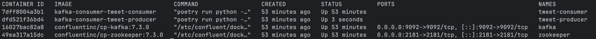
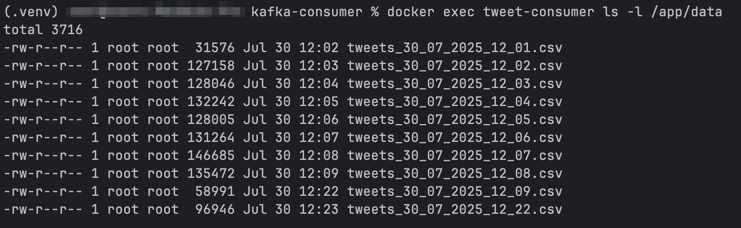
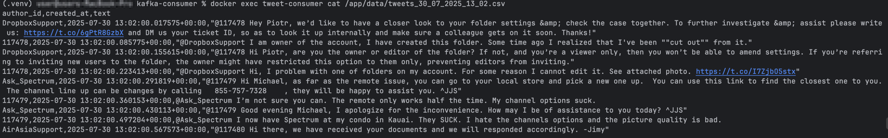

# Kafka Consumer

Цей проєкт реалізує Kafka consumer, який підписується на тему `tweets`, зчитує повідомлення, обробляє їх і зберігає у
CSV-файли, що створюються щохвилини.

Проєкт є продовженням [HW-8](../../HW-8/kafka-producer/README.md), де було реалізовано продюсер, що генерує дані про
твіти.

---

## 🛠️ Технології

- **Мова**: Python 3.9+

- **Керування залежностями:** Poetry

- **Контейнеризація:** Docker, Docker Compose

---

## 🚀 Архітектура

Система складається з чотирьох основних компонентів, які запускаються за допомогою Docker Compose:

Zookeeper: Необхідний для координації роботи Kafka.

Kafka: Брокер повідомлень, що приймає та зберігає повідомлення.

tweet-producer: Продюсер з попереднього завдання (HW-8), який генерує та надсилає повідомлення у тему `tweets`.

tweet-consumer: Новий компонент (HW-9), який зчитує повідомлення з теми `tweets` та зберігає їх у файли.

Дані (`author_id`, `created_at`, `text`) зберігаються у CSV-файли в директорії `output_data`. Новий файл створюється
щохвилини у
форматі `tweets_dd_mm_yyyy_hh_mm.csv`.

---

## Швидкий старт

1. Склонуйте репозиторій:

  ```bash
    git clone https://github.com/mlozhevych/setuniversity-de.git
    cd HW-9/kafka-consumer
  ```

2. Створіть файл `.env` у корені проєкту (`kafka-consumer/`).
3. Надайте права на виконання скрипту запуску:
    ```bash
    chmod +x restart-kafka.sh
    ```
4. Запустіть усі сервіси за допомогою скрипта:
    ```bash
    ./restart-kafka.sh
    ```
   Ця команда побудує образи та запустить усі контейнери у фоновому режимі.

---

## ✅ Перевірка результатів

### 1. Перевірка запущених контейнерів.

Щоб переконатися, що всі компоненти системи працюють, виконайте команду:

```bash
    docker ps
```

Ви повинні побачити чотири активні контейнери: `zookeeper`, `kafka`, `tweet-producer` та `tweet-consumer:`


### 2. Перегляд логів споживача (consumer).

Щоб спостерігати за роботою споживача в реальному часі, виконайте:

```bash
    docker-compose logs -f tweet-consumer
```

Ви повинні бачити повідомлення про успішне зчитування та запис даних у CSV-файли.

### 3. Перегляд згенерованих файлів.

Зачекайте 10-15 хвилин, щоб система згенерувала достатньо даних. Після цього перевірте вміст директорії `/app/data`:

```bash
   docker exec tweet-consumer ls -l /app/data
```

Ви побачите список CSV-файлів:



Це підтверджує, що програма всередині контейнера успішно створює та записує файли у свою
внутрішню директорію `/app/data`.

### 4. Перегляд вмісту файлу (всередині контейнера).

Щоб переглянути дані всередині одного з файлів, також скористаємося `docker exec` для виконання команди `cat` в
контейнері:

```bash
   docker exec tweet-consumer cat /app/data/tweets_dd_mm_yyyy_hh_mm.csv
```




**Примітка:** не забудьте замінити tweets_dd_mm_yyyy_hh_mm.csv на реальну назву файлу зі списку вище

## 📂 Структура проєкту

```
kafka-consumer/
├── data/                       
├── src/
│   └── consumer/
│       ├── __init__.py
│       ├── consumer.py
│       └── utils.py
├── docker-compose.yml
├── .env                        
├── Dockerfile
├── pyproject.toml
├── README.md
└── restart-kafka.sh
```